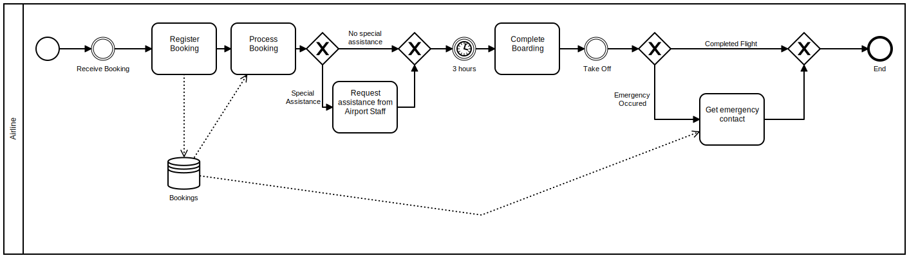
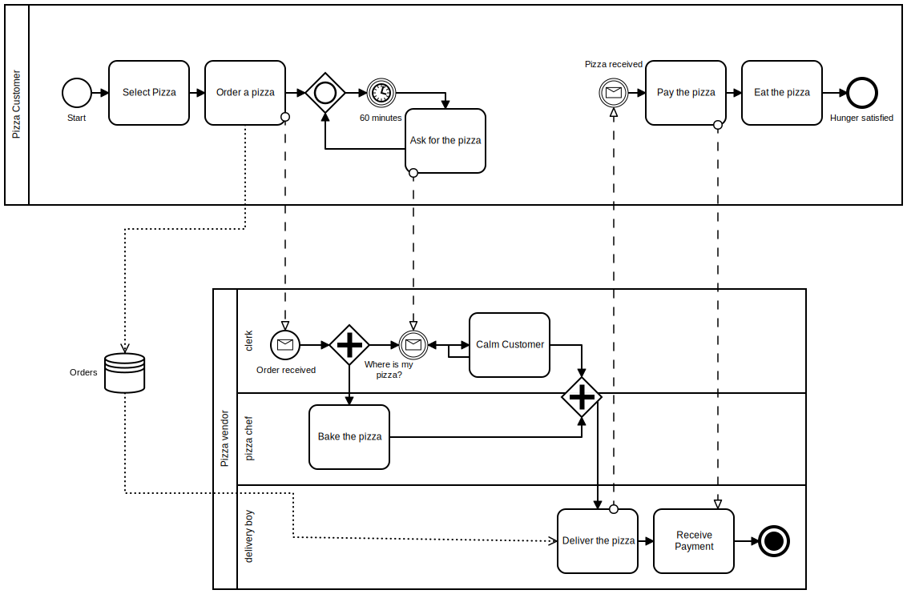
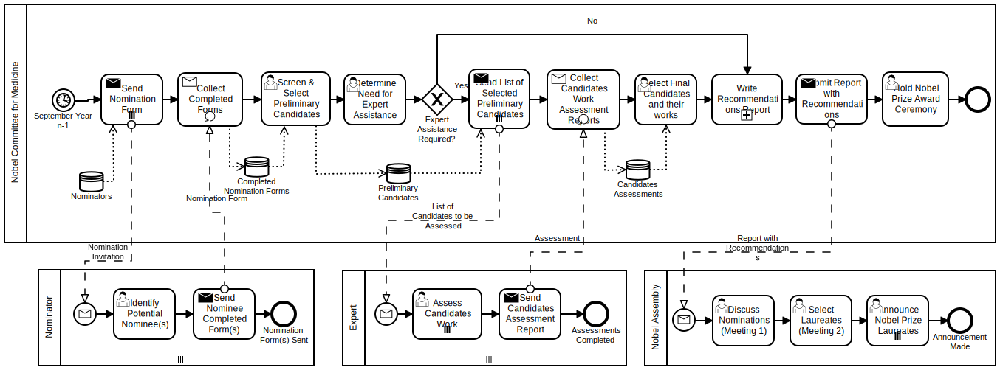
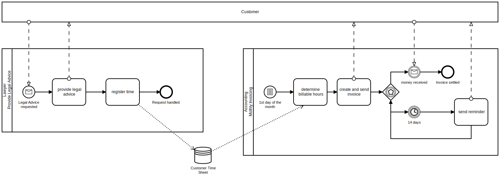
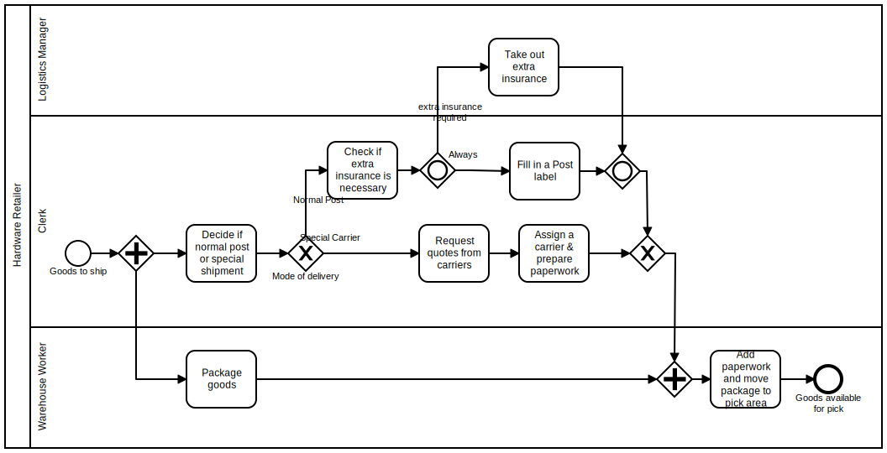

# ElleWoods
Fall 2020, IT University of Copenhagen

## Description
ElleWoods is an automated-tool tailored for GDPR compliance that can assist companies in their audit of existing business processes. Themis transforms any given BPMN diagram into a finite state machine and determine compliance with the GDPR using model checking techniques. 

### Dependencies
ElleWoods is built with pytransitions: https://github.com/pytransitions/transitions, and PyNuSMV (https://pypi.org/project/pynusmv/)

## Quick start 
To run ElleWoods, we must provide an BPMN model in .bpmn-format, and a XML-file data that specific task use. 

```shell
python themis.py --bpmnxml bpmnmodel.bpmn --taskdataxml taskdata.xml
```

## Options
| Option      | param |
| ----------- | ----------- |
| `--bpmnxml` filepath | Path to *.xml-file representing the BPMN 
| `--taskdataxml` filepath | Path to *.xml-file matching tasks with data processing |
| `--rename-states` | - |
| `--compress-graph` | - |
| `--show-paths` | - |
| `--create-dot-graph` | - |


## Examples 
### Airtravel


### Pizza


### Nobelprize


### Order fulfillment


### Monthly Invoicing


### Hardware Retailer


